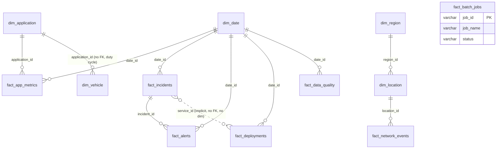

# 03 — Database Schema Reference

> Sections 1–6 describe the schema **as found on 2026-10-01**. Section 7 adds the licensing tables (001–003) and section 8 the operations redesign (004–007), which changes several IT-owned tables described in section 1.

Source: `enterprise-dashboard/schema.sql` (pg_dump of the shared Supabase `public` schema), cross-checked against the live database on 2026-10-01 through the REST API.

> **`schema.sql` is stale.** The live database also contains objects the dump lacks: Telematics' `mv_telemetry_daily`, `v_failure_precursor` and `v_failure_precursor_summary`, plus Warranty's `wty_*` tables, views and RPCs (migrations 001–017, applied 2026-09-30 → 10-01), and `fact_warranty_claims` now has `date` columns plus `claim_amount_inr`. Re-dump before relying on this file for non-IT tables.

Conventions: star schema, `dim_*` dimensions, `fact_*` facts, string surrogate keys (`APP001`, `INC00001`, `REG001`…). Most IT facts carry a `date_id date` FK to `dim_date` plus an integer `time_id` with **no time dimension table** (range 0–2358, looks like HHMM-ish but includes invalid values such as 1588 and 1669, so treat it as noise).

---

## 1. IT operations tables (the ones this app cares about)

### `dim_application` — **SHARED, dual meaning** (8 rows)

| Column | Type | Notes |
|---|---|---|
| application_id **PK** | varchar(20) | APP001–APP008 |
| application_name | varchar(100) | **Vehicle duty-cycle segments**, e.g. "Tanker Transport", "Mining & Construction Haulage" — *not* software |
| sub_application_name | varchar(100) | e.g. "POL / Non-POL Liquids" |
| tier | int | 1 = APP004, APP006, APP007; 2 = APP001–003; 3 = APP005, APP008 |
| business_vertical | varchar(100) | Sales / HR / Finance only, assigned arbitrarily |
| expected_monthly_uptime_minutes | int, default 43200 | 30 × 1440; app ignores it and uses 1440/day |

Referenced by `fact_app_metrics.application_id` (FK) **and** `dim_vehicle.application_id` (no FK, but Telematics filters vehicles by it as "duty cycle" through `v_vehicle_context`). Do not rename or repurpose it. See 04.

### `fact_app_metrics` — IT-owned (5,000 rows)

| Column | Type | Notes |
|---|---|---|
| metric_id **PK** | varchar(50) | AM000001… |
| application_id FK→dim_application | varchar(20) | |
| date_id FK→dim_date | date | 2025-01-01 → 2026-12-31 |
| timestamp | timestamp | **Disagrees with date_id in 4,994 of 5,000 rows** |
| uptime_minutes | int | 1380–1439 (i.e. a per-day figure, 95.8–99.9%) |
| total_transactions | int | 1,029–49,999 |
| failed_transactions | int | always = total − api_successes |
| avg_api_latency_ms | numeric | 15–350 |
| api_requests | int | **always identical to total_transactions** |
| api_successes | int | |

Grain is nominally app × day, but there are only 3,341 distinct app-days for 5,000 rows (1,659 duplicates) and ~4.6 rows/app/month, so most app-days have **no** row.

### `fact_incidents` — IT-owned (1,500 rows)

| Column | Type | Notes |
|---|---|---|
| incident_id **PK** | varchar(50) | INC00001… |
| service_id | varchar(50) | SRV001–SRV010, **no dimension table** |
| date_id FK→dim_date | date | = open_time date |
| time_id | int | noise |
| causal_confidence_score | int | 50–99, unused |
| mttr_minutes | int | 15–299; **matches open→resolution timestamps in only 3 rows** |
| priority | int | 1–4, evenly split (~25% each) |
| status | varchar(50) | `Resolved` 1,266 / `Active` 234 (Active rows still have resolution_time) |
| affected_business_unit | varchar(100) | Sales, Finance, Manufacturing, HR, Logistics |
| root_cause_type | varchar(100) | External, Change, Software, Network, Hardware (~20% each) |
| open_time / resolution_time | timestamp | **645 rows (43%) resolve before they open** |

### `fact_alerts` — IT-owned (6,000 rows), unused by the app

`alert_id` PK, `service_id`, `date_id` FK, `time_id`, `incident_id` FK→fact_incidents, `alert_severity` (Critical/High/Medium/Low ≈ 25% each). Every alert points at an incident (1,471 distinct), but the alert's date equals the incident's date in only 3 cases and its service matches in only 616.

### `fact_deployments` — IT-owned (2,250 rows)

`deployment_id` PK, `service_id`, `date_id` FK, `time_id`, `change_type` (Code / Config / Rollback ≈ ⅓ each), `pr_count` (1–4). No success/failure flag, no link to the incidents a change caused, no application.

### `fact_batch_jobs` — IT-owned (2,000 rows), unused

`job_id` PK, `job_name` (16 values: `Pipeline_{ERP_Sync|HRIS_Export|CRM_Backup|Telemetry_Ingest}_{1..4}`), `status` (Success 1,757 / Failed 155 / Running 88), `start_time`, `end_time` (null when Running; durations 5–179 min). No date_id and no SLA.

### `fact_network_events` — IT-owned (5,000 rows), unused

`event_id` PK, `location_id` FK→dim_location (all 100 sites: 76 dealers, 14 warehouses, 10 plants), `timestamp`, `device_type` (Scanner, IoT Gateway, Edge Router, Switch), `avg_ping_ms` (5–250), `disconnect_count` (0–11). This is the natural source for IT-to-OT and site health, and it is the only IT table with a geographic link (→ location → region).

### `fact_data_quality` — IT-owned (730 rows), unused

`dq_id` PK, `date_id` FK (one row per day 2025-01-01 → 2026-12-31), `total_expected_packets`, `valid_packets_received`. Fleet-wide telemetry ingestion completeness (~96%). No per-source split. Telematics has its own per-vehicle `packets_expected/received` in `fact_vehicle_daily`.

---

## 2. Shared dimensions the IT app can join to

| Table | Rows | PK | Key columns | Notes for IT |
|---|---|---|---|---|
| dim_date | 730 | date_id | year, month_number, month_name, quarter | 2025–2026 calendar |
| dim_region | 5 | region_id | region_name (North/South/East/West/Central), state, country=India | Region filter source |
| dim_location | 100 | location_id | location_name, region_id FK, address, location_type (Dealer/Warehouse/Plant) | Path to region for network events |
| dim_customer | 2,000 | customer_id | customer_name, customer_type, region_id FK | |
| dim_vehicle | 10,000 | vehicle_id | vin, model_id, customer_id, location_id, application_id, is_connected, telematics_unit_id… | |
| dim_v_model | 5 | model_id | model_name, variant, segment, powertrain… | |
| dim_dealer | 100 | dealer_id | dealer_name, region_id, dealer_tier… | |
| dim_part / dim_supplier | 50 / 20 | | | Warranty/Telematics |

## 3. Other-domain tables (for reference only)

| Domain | Tables |
|---|---|
| Telematics | fact_telemetry (289,934), fact_vehicle_status, fact_vehicle_daily (18,000), fact_trip, fact_harsh_events, fact_dtc_event, fact_vehicle_health, fact_charging_session, fact_part_demand_forecast, dim_signal, dim_dtc, dim_driver, bridge_dtc_part, *_legacy tables |
| Warranty / Service | fact_warranty_claims (3,491), fact_repair_orders (5,244), fact_part_replacement, dim_standard_repair_times |
| Sales | fact_booking, fact_sales_transaction (5,566; sale_date 2025-06-10 → 2026-09-23), fact_sales_target, fact_nv_vehicle_delivery, sales_vehicle_reassignment |
| Logistics | dim_route, fact_transporter, fact_vehicle_dispatch, fact_transportation_cost, fact_logistics_exception, fact_vehicle_movement_history, fact_vehicle_inventory, fact_l_vehicle_delivery |
| Service desk / CX | fact_service_case (5,000), fact_case_status_history, fact_complaints, fact_customer_feedback |
| Inventory | fact_part_inventory |

Full column lists: `schema.sql` lines 30–985.

## 4. Views

`v_vehicle_context` (security_invoker): one row per vehicle with model, customer, location, region, **application_name** (duty cycle) and primary driver. It is the reason `dim_application` must keep its current meaning.

## 5. ER diagram (IT slice)

**Structural gaps:**
- No `service` dimension: `service_id` (SRV001–010) appears in incidents, alerts and deployments but has no name, owner, tier or link to an application.
- No IT application/software catalogue (and `dim_application` cannot become one).
- No region on any IT fact except through `fact_network_events → dim_location`.
- No link from a deployment to the incident it caused, and no change-failure flag.
- No security or vulnerability tables. *(Licensing tables were added on 2026-10-01; see §7.)*

## 6. Keys, indexes, RLS

- Every IT fact has a single-column PK. IT tables have **no secondary indexes**; the 21 non-PK indexes in the dump all belong to Telematics tables.
- RLS **enabled**, public-read policy: fact_app_metrics, fact_batch_jobs, fact_network_events, fact_data_quality, dim_date, dim_vehicle, dim_part, dim_supplier, plus the Telematics tables.
- RLS **disabled**: fact_incidents, fact_alerts, fact_deployments, dim_application, dim_region, dim_location, and every sales/logistics/service table.
- `GRANT ALL … TO anon` on all IT tables, and `ALTER DEFAULT PRIVILEGES … GRANT ALL ON TABLES TO anon`. Any new table is writable by the public key until RLS is enabled.

## 7. IT licensing tables (added 2026-10-01, migrations 001–003)

All are IT-owned (`it_` prefix), RLS read-only, anon writes revoked. Only `dim_region` is referenced among shared tables, as an FK target; it was not modified.

| Table | Grain | Key columns |
|---|---|---|
| it_license_config | key/value | as_of_date, fy_start_month, dormant_days, target_utilisation, renewal/decision windows |
| it_dim_vendor | vendor | vendor_name, vendor_category, risk_tier, support_tier |
| it_dim_software | product | software_name, short_name, vendor_id → it_dim_vendor, category, deployment, business_vertical, criticality_tier |
| it_fact_contract | contract | software_id, start/end_date, auto_renew, notice_period_days, billing_frequency, annual_value_inr, original_currency, uplift_cap_pct, status |
| it_fact_entitlement | contract × edition | license_metric, seats_purchased, unit_price_inr_month; unique (software_id, edition) |
| it_fact_license_usage_monthly | product × edition × region × month | seats_allocated, seats_assigned, seats_active_90d, seats_active_30d |
| it_fact_license_assignment | seat | employee_alias (synthetic), department, region_id, assigned_date, last_login_date, status |
| it_fact_software_spend_monthly | product × region × month | budget_inr, actual_inr (null after as-of), invoice_count, note |
| it_license_document | document | contract_id, doc_type, title, version, effective_date, file_url, is_current, is_signed |

RPCs and formulas: [modules/licensing-and-subs.md](modules/licensing-and-subs.md).

## 8. IT operations redesign (migrations 004–007)

**New tables**

| Table | Grain | Key columns |
|---|---|---|
| it_config | key/value | as_of_date 2026-09-30, history_start, MTTR targets by priority, patch SLA days by severity, pipeline / telemetry / CFR targets |
| it_dim_service | service (SRV001–010) | service_name, short_name, software_id → it_dim_software, owning_team, tier, business_vertical, slo_availability, slo_latency_p95_ms, cost_of_downtime_inr_per_min |
| it_bridge_change_incident | deployment × incident | confidence |
| it_fact_vulnerability | vulnerability | VULN-#### id, severity, cvss, exploit_available, asset_class, assets_affected, software/service/region, discovered/due/patched dates, status |
| it_fact_security_incident | security incident | vector, severity 1–3, impact/detected/contained/resolved times, status, region, department, software |
| it_fact_threat_daily | day × vector | detected, blocked |
| it_fact_phishing_sim | month × department | emails_sent, clicked, reported |
| it_fact_security_risk | risk | likelihood, impact, owner, software/service, status, treatment, review_date |

**Changed IT-owned tables** (data regenerated by 005; Apr-2025 → Sep-2026, nothing future-dated)

| Table | Change | Rows |
|---|---|---|
| fact_app_metrics | one row per service × day; `service_id` FK it_dim_service; + `p95_latency_ms`; `application_id` (FK to shared dim_application) and `timestamp` dropped; unique (service_id, date_id) | 5,480 |
| fact_incidents | + impact_start_time, detected_time, acknowledged_time, region_id (FK dim_region), location_id (FK dim_location), title; FK service; CHECKs on lifecycle order and status/resolution; mttr_minutes = resolution − open | 601 |
| fact_alerts | + alert_time; FK service; incident_id null = noise | ≈ 3,840 |
| fact_deployments | + deploy_time, status (Success/Failed), lead_time_hours, rollback_of; FK service | 1,527 |
| fact_batch_jobs, fact_network_events, fact_data_quality | **not touched** (their modules were dropped; the original random data stays as it was) | 2,000 / 5,000 / 730 |

`dim_application` is no longer referenced by any IT table.

## 9. Licensing suite additions (migrations 008–010)

- `it_fact_invoice` (new, 76 rows): invoice per billing period, status Paid / Due / Overdue / Disputed, amounts incl. GST, note.
- `it_fact_contract` + `predecessor_contract_id` (self FK), `renewal_quote_inr`; 8 expired predecessor contracts added.
- `it_dim_vendor` + `payment_terms_days`, `preferred`, `certifications text[]`, `account_team`.
- `it_license_document`: `contract_id` now nullable; + `vendor_id`, `invoice_id`, `expiry_date`; doc type **Security Assessment** added; 164 rows (contract-, vendor- and invoice-level).
- 17 new/replaced RPCs; see [modules/licensing-and-subs.md](modules/licensing-and-subs.md).
